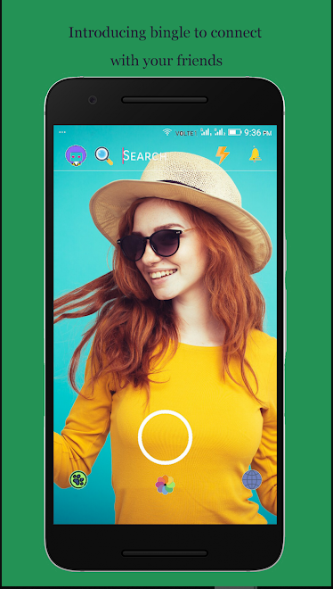
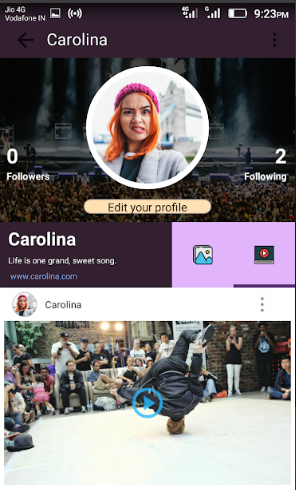
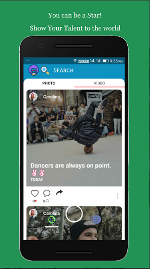

# Bingle- A Social Networking App to Connect People

Bingle is a talent competition where performers compete to win cash prizes across music, dance, magic, extreme sports, comedy, and more. Join us live and vote in our daily Live Lightning competition.
Not a performer? Be the judges in helping decide who moves on to the next stage!

HERE'S HOW IT WORKS:

Performers, you submit one video to the BINGLE app. Make it your best performance video. Make it amazing.

Fans will be voting on the app all month long. So the sooner you get your video up, the more time you have to gather votes.

There is no limit to the number of performers who can enter if you are eligible.
IT'S TIME TO BE A SUPERSTAR.

PERFORMERS:
• Share your talents while you build your followers and fan base!
• Encourage fans to vote on your audition video to rank among the top performers worldwide.
• Live stream and interact with fans in real time.

FANS:
• Discover talent and support your favorite performers by voting for them in the daily Live Lightning competition.
• Watch, comment, and share your favorite videos with your friends.
• Chat and virtually gift your favorite performers in the live stream.

CONNECT WITH US:

•www.bingle.in

•Facebook: https://www.facebook.com/bingleofficial/

Need Help: * contact@bingle.in
           * shrdprk34@gmail.com
